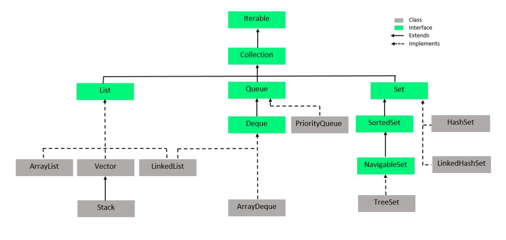
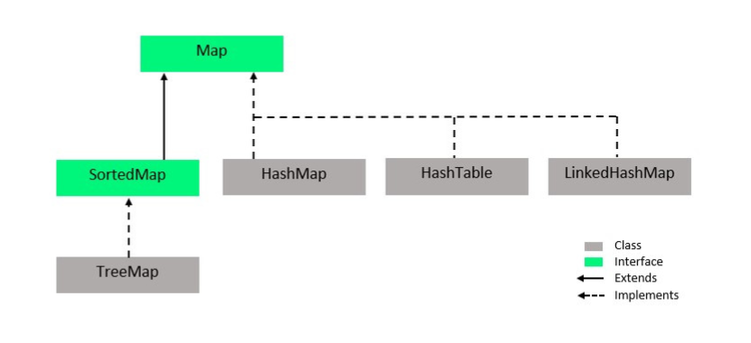
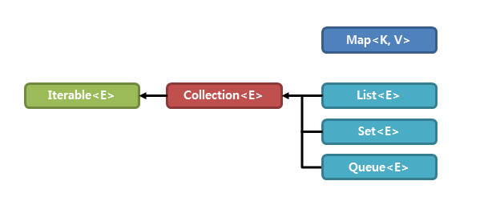

# Java Collection


### 개념
Java Collection framework란 다수의 데이터를 쉽고 효과적으로 처리할 수 있는 표준화된 방법을 제공하는 클래스의 집합을 의미한다.   
즉, 데이터를 저장하는 자료구조와 데이터를 처리하는 알고리즘을 구조화하여 클래스로 구현해 놓은것이다.
이러한 컬렉션 프레임워크는 자바의 인터페이스를 사용하여 구현된다.

### Collection 계층구조





List와 Set인터페이스는 모두 Collection 인터페이스를 상속받지만, 구조상의 차이로 인해 MAP 인터페이스는 별도로 정의된다.
따라서 List 인터페이스와 Set 인터페이스의 공통된 부분을 Collection 인터페이스에서 정의하고 있다.

```java
public interface List<E> extends Collection<E> {
    ...
}
```



위의 그림에서 <E> <K,V>를 통해 알 수 있듯이, 컬렉션 프레임워크를 구성하는 모든 클래스가 제네릭으로 표현되어 있음을 알려준다.

### 주요 인터페이스 특징
|인터페이스| 설명                                                     | 구현 클래스 |
|:---     |:---                                                     |:---       |
|List<E>  |순서가 있는 데이터의 집합으로, 데이터의 중복을 허용함          |   Vector, ArrayList, LinkedList, Stack, Queue        |
|Set<E>   |순서가 없는 데이터의 집합으로, 데이터의 중복을 허용하지 않음    |   HashSet, TreeSet        |
|Map<K,V> |키와 값의 한 쌍으로 이루어지는 데이터의 집합으로 순서가 없음<br> 이때 키는 중복을 허용하지 않지만 값은 중복을 허용함| HashMap, TreeMap, HashTable, Properties          |


```java
public interface List<E> extends Collection<E> { // List 인터페이스는 Collection 인터페이스를 상속받는다.
    ...
}

public class LinkedList<E>
    extends AbstractSequentialList<E>
    implements List<E>, Deque<E>, Cloneable, java.io.Serializable { // LinkedList는 List 인터페이스를 구현한 구현 클래스이다.
    ...
}
```

### Collection 인터페이스
List와 Set인터페이스의 많은 공통된 부분을 Collection 인터페이스에서 정의하고 두 인터페이스는 이것을 상속받는다. (extends Collection<E>)
따라서 Collection 인터페이스는 컬렉션을 다루는데 가장 기본적인 동작들을 정의하고 그것을 메소드로 제공하고 있다.

|메소드|설명|
|:---|:---|
|boolean add(E e)| 해당 컬렉션에 전달된 요소를 추가|
|void clear|해당 컬렉션의 모든 요소를 제거|
|boolean contains(Object o)|해당 컬렉션이 전달된 객체를 포함하고 있는지를 확인|
|boolean equals(Object o|해당 컬렉션과 전달된 객체가 같은지를 확인|
|int size()|해당 컬렉션의 요소의 총 개수를 반환|
|Object[] toArray()|해당 컬렉션의 모든 요소를 Object타입의 배열로 반환|

[출처 1](https://www.geeksforgeeks.org/how-to-learn-java-collections-a-complete-guide/)    
[출처 2](http://www.tcpschool.com/java/java_collectionFramework_concept)


