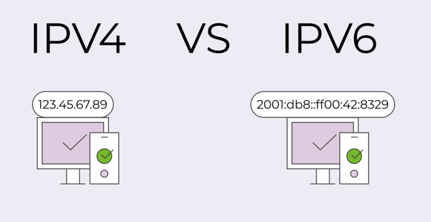
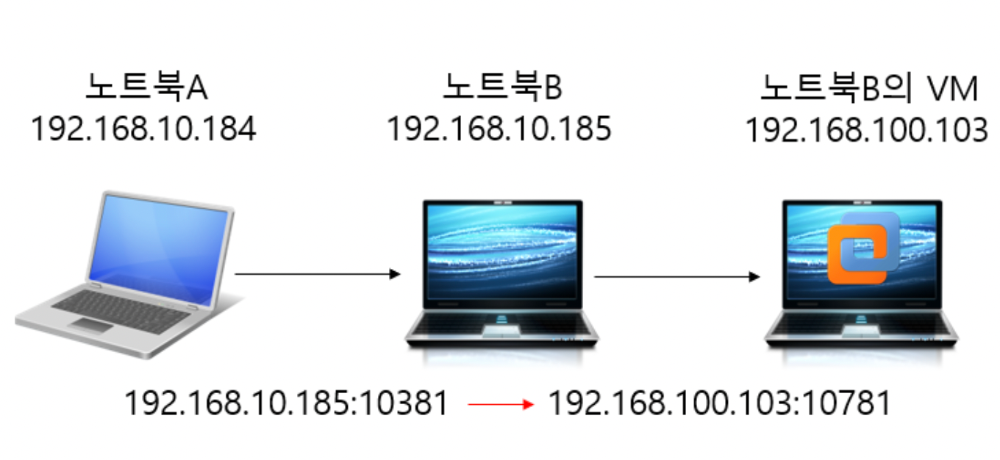

# 가상머신 네트워크

## 상황
오늘 Red Hat Enterprise Linux에 띄운 sast서버에다가 로컬에 설치한 client로 분석을 날리면 RAC서버가 없다는 에러메시지와 함께 분석이 실패하는 문제가 있었다.

## 원인 및 해결
RHEL에 띄운 SAST RAC서버의 포트는 10100인데, vm에서 RAC서버에 대해서 10111로 포트포워딩이 되어있어서 RAC서버를 찾을 수 없었던 것 이다.
따라서 포트포워딩 설정을 10100으로 바꿔서 해결했다.

## 공부할 것 
해당 과정에서 내가 네트워크 공부가 부족하다고 느껴졌다.
따라서 아래의 항목들을 공부해보려고 한다!

- 가상머신에서의 네트워크 종류
- 포트포워딩

## 가상머신에서의 네트워크 종류
가상머신에서의 네트워크 종류는 Bridged, NAT, Host-only로 나뉜다.   
- Host-Only
  - 외부와 단절된 내부 네트워크를 구축하는것으로, 구성된 가상머신 즉, vm등의 가상 머신 내에 존재하는 머신들끼리만 통신이 가능.   
- NAT
  - 호스트 pc로부터 ip를 할당받아 가상머신 프로그램 자체 DHCP서버를 띄워 내부 네트워크 대역 할당 및 통신, 해당 호스트 PC를 이용하여 외부 네트워크와 통신이 가능함.   
- Bridge
  - 공유기로부터 IP를 할당받아, 호스트 pc와 동일한 네트워크 대역의 IP를 갖게됨, 공유기를 통해 외부 네트워크 통신이 가능   
  - Host pc가 공유기와 연결되어 있다면, Bridge모드로 설정한 vm역시 공유기의 ip를 제공받게 된다.
  - 따라서 Host의 OS와 동등한 네트워크 위치를 가질 수 있고 인터넷도 사용할 수 있다.

### NAT(Network Adress Translation)
NAT방식의 경우 호스트PC로부터 IP를 할당받기 때문에, 가상머신이 자체적으로 DHCP(Dynamic Host Configuration Protocol) 서버를 사용하여 내부 네트워크 대역을 할당 및 통신을 하며,
호스트 pc를 통해 외부 네트워크와 통신이 가능하다.
Nat의 경우는 기본적으로 내부네트워크의 사설 IP 주소로는 외부와 통신을 할수 없다.
외부와 통신을 하기 위해서는 공인 IP주소를 통해서만 통신을 할 수 있는데 사설 IP를 공인 IP로 변환해주는 역할을 하는것이 NAT이다.

### DHCP server
동적 호스트 설정 통신 규약
통신을 하기위한 설정값들인 IP Address, NetMask, GateWay등의 설정을 자동으로 해주는 서버!

### 공인 IP vs 사설 IP
ip주소라고 하면, IPV4 IPv6 2가지가 있다.
일반적으로 IP라고 하면 IPV4주소를 말한다.
IPV4는 Ip version 4의 약자로 전세계적으로 사용된 첫번째 인터넷 프로토콜이다.
4개의 점으로 구분된 10진수 형식을 말한다.
근데 경우의수가 부족해져서 나타난게 ipv6이다.   

아이피는 4가지로 나뉜다.
- 고정 IP
  - 컴퓨터에 고정적으로 부여된 IP
  - 한번 부여되면 ip 반납을 하기전까지는 다른 장비에 부여할 수 없는 고유의 ip로 보안성이 우수하다.
  - 기관이나 보안이 중요한 업체에서 사용
- 유동 IP
  - 인터넷 사용자 모두에게 고정 ip를 부여하기 어려워서 일정한 주기 또는 사용자들이 인터넷에 접속하는 매 순간마다 ip주소를 임시로 발급해준다.
  - 대부분의 사용자는 유동 ip를 사용한다.
- 공인 IP
  - ip주소는 ICANN이라는 기관이 국가별로 사용할 ip 대역을 관리하고, 우리나라는 KISA에서 국내 IP주소들을 관리하고 있다.
  - 이것을 ISP(인터넷을 제공하는 통신업체)가 부여받고 우리는 이 회사에 가입을 해서 ip를 제공받아서 인터넷을 사용하게 된다.
  - 이렇게 발급받은 ip를 공인 ip라고 한다! 
- 사설 IP
  - 공유기를 사용한 인터넷 접속 환경일 경우 공유기까지는 공인 ip를 할당받지만, 공유기에 연결되어 있는 가정이나 회사의 각 네트워크 기기에는 사설 ip를 할당한다.
  - 즉, 사설 ip는 네트워크 안에서만 내부적으로 사용되는 고유한 주소이다.
  - 사설 ip는 보통 내 컴퓨터에서 사용하는 로컬 ip라고 불린다.

### 포트포워딩
포트는 ip주소라는 벽에 있는 문과 같은것인데, ip주소에는 수만개의 문이 있다.   
일부 특정 포트는 각 포트를 활용하는 역할이 부여되어 있다. (22)   
만약 외부에서 1.231.xxx.xxx라는 서버 ip쪽에 접근하려고 한다. 근데 1.231.xxx.xxx가 이 서버를 띄운 컴퓨터로 바로 접근되는게 아니라, 공유기를 거쳐서 연결된다.   
공유로부터 할당받은 서버를 띄운 컴퓨터의 ip는 192.168.0.2라고 하자.   
그럼 외부에서 1.231.xxx.xxx의 특정 포트로 접속했을 때, 192.168.0.2로 연결시켜주는것을 포트포워딩이라고 한다.   
1. Nat 네트워크 포트포워딩    

### 의문점
그럼 host pc랑 같은 망에 있는 pc는 브릿지로 설정된 vm에 포트포워딩 없이 접근이 가능한건가?

## 출처
[NAT 설명 출처](https://hg2lee.tistory.com/entry/Network-%EA%B0%80%EC%83%81%EB%A8%B8%EC%8B%A0%EC%97%90%EC%84%9C-%EB%84%A4%ED%8A%B8%EC%9B%8C%ED%81%AC%EC%9D%98-%EC%A2%85%EB%A5%98-Bridged-NAT-Host-onl)  
[포트포워딩 설명 출처](https://developerhjg.tistory.com/182)   
[NAT에서의 포트포워딩 사진 출처](https://klero.tistory.com/entry/Vmware-Workstation-%ED%8F%AC%ED%8A%B8-%ED%8F%AC%EC%9B%8C%EB%94%A9-%ED%95%98%EB%8A%94-%EB%B0%A9%EB%B2%95)   
[공인 ip vs 사설 ip 설명 출처](https://inpa.tistory.com/entry/WEB-%F0%9F%8C%90-IP-%EA%B8%B0%EC%B4%88-%EC%82%AC%EC%84%A4IP-%EA%B3%B5%EC%9D%B8IP-NAT-%EA%B0%9C%EB%85%90-%EC%A0%95%EB%A7%90-%EC%89%BD%EA%B2%8C-%EC%A0%95%EB%A6%AC)