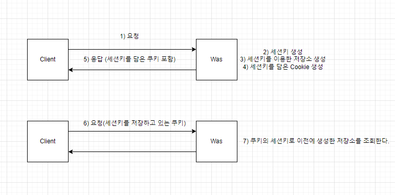

# Session

## session?
개념: 클라이언트 별 상태 정보를 서버에 저장하는 기술 중 하나.   
목적: 클라이언트의 연속적 동작을 지원   
동작: 클라이언트별로 세션 ID를 부여하고 상태 정보를 유지   



*5) 응답
응답할 때 세션키를 담은 쿠키를 어떻게 보낼까?   
Set-Cookie라는 HTTP Response Header를 이용하여 보낼 수 있다.
```http request
Set-Cookie: <cookie-name>=<cookie-value>

HTTP/1.0 200 OK
Content-type: text/html
Set-Cookie: id=beomy
Set-Cookie: post=cookie
```
서버가 Set-Cookie를 통해 브라우저로 쿠키를 보내면 브라우저는 가지고 있다가 동일한 도메인에 대해 해당 쿠키를 보낸다.

*6) 요청   
브라우저는 Cookie헤더에 서버에서 전달받은 모든 쿠키들을 담아 서버에 요청을 보내게 된다.
```http request
GET /sample_page.html HTTP/1.1
Host: beomy.github.io
Cookie: id=beomy; post=cookie
```
### 쿠키 속성
서버에서 쿠키를 전송할 때 만료일, 지속 시간, 도메인, 경로 속성을 추가해서 전송할 수 있다.   
만료된 쿠키는 서버로 다시 전송되지 않는다.   
도메인과 경로속성이 정의되어 있다면, 특정 도메인과 경로에만 쿠키를 전송할수 있다.
```http request
Set-Cookie: id=beomy; Expires=Sun, 29 Aug 2021 12:00:00 GMT;
Set-Cookie: id=beomy; Max-Age=600;
```
### 세션 쿠키
Expires와 Max-Age가 정의되지 않은 쿠키를 세션 쿠키라고 한다.
세션 쿠키는 현재 브라우저의 세션이 끝날 때 삭제되는 쿠키이다.

## HttpSession
```java
// 세션이 없다면 생성
HttpSession httpSession = request.getSession(true);

// 값 저장 (공지사항 팝업 여부등을 저장)
session.setAttribute(String name, Object value);

// 값 얻기
Object obj = session.getAttribute(String name);

```
## @SessionAttributes
HttpSession을 직접 사용할수도 있지만, 좀더 추상화된 방법인  @SessionAttrbutes 어노테이션을 사용할수도 있다. 
- 세션에 저장되는 속성을 지정하는 클래스 레벨의 어노테이션이다.
- 컨트롤러 메소드가 생성하는 모델정보 중 @SessionAttributes에 지정한 이름과 동일한 이름이 있다면, 이를 세션에 저장해준다.
- 이후 ModelAttribute가 지정된 파라미터가 있으면 이 파라미터에 전달해줄 오브젝트를 세션에서 가져온다.
    - 세션에 같은 이름의 객체가 존재하는지 확인
    - 있으면 전달
    - 없으면 새로 생성해서 전달
    
[출처 1](http://www.tcpschool.com/php/php_cookieSession_session)   
[출처 2](https://sh77113.tistory.com/243)   
[출처 3](https://djlee118.tistory.com/40)